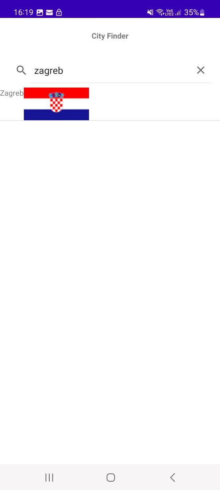

# CityFinder
The server is done in mongodb, I add data to it trough node.js.
I get the endpoint for my api after making an app service in mongodb in order to expose it.
I get data from the server though the RetrieveInfo function in my ICityFinder.aidl. It has as a parameter a callbuck function that is also from another aidl interface named ICallback.The RetrieveInfo function uses volley to get a json array of all my data and when it has a response it calls the callback function with the response as a parameter.
In the main activity and citypage the service is binded on start and unbinded on stop.Inside OnServiceConnected I call the retrieveInfo function and implement it's callback inside of which I give a JSONArray from the activity the value of the stringResponse by transforming it in a JSONArray.
From then on I simply set the text for all the elements inside a runonUIThread() function.
The getDistance function is also in the aidl. It uses a formula based on the coordinates to give the distance between 2 cities.
In the main activity I use a ListAdapter in order to add items that contain a textview and an image.
Also on some cities I didn't find some data like the metropolitan area occuppied.In that case the app will show the value null.
If in the searchView the list will filter to empty it will show a toast saying No result found. In the CityPage if you enter a wrong city name, it will show you a toast as well.
Main Activity

Search

City Page

Distance Calculator

